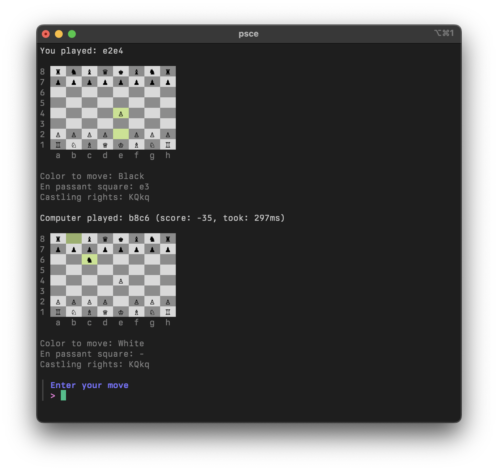

# Pretty Solid Chess Engine

**PSCE** is a chess engine written in Go. It's able to beat casual players, but it'll lose to any decent chess engine.



## Usage

```sh
go run ./cmd/psce
```

## Features

- Magic bitboard move generation
- FEN parsing
- Fixed depth minimax search
- Alpha-beta pruning
- Move ordering via MVV/LVA and killer heuristic
- Quiescence search
- Naive piece-square evaluation
- Simple command-line interface